#### https://start.spring.io 创建项目

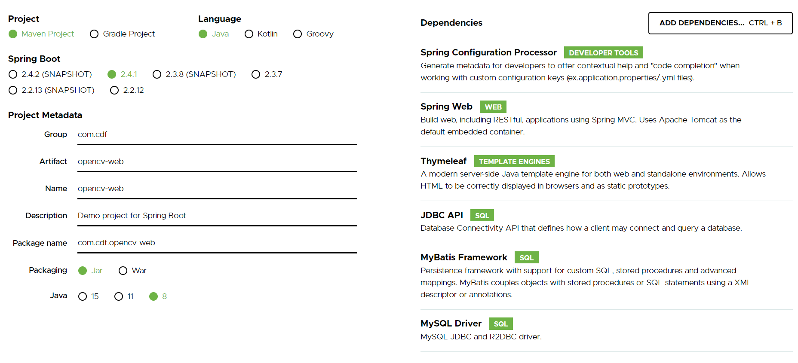

#### 搭建 helloworld 

##### pom.xml

```xml
<parent>
    <groupId>org.springframework.boot</groupId>
    <artifactId>spring-boot-starter-parent</artifactId>
    <version>2.3.7.RELEASE</version>
    <relativePath/> <!-- lookup parent from repository -->
</parent>
<groupId>com.cdf</groupId>
<artifactId>opencv-web</artifactId>
<version>0.0.1-SNAPSHOT</version>
<name>opencv-web</name>
<description>Demo project for Spring Boot</description>

<properties>
    <java.version>1.8</java.version>
</properties>

<dependencies>
    <dependency>
        <groupId>org.springframework.boot</groupId>
        <artifactId>spring-boot-starter-thymeleaf</artifactId>
    </dependency>
    <dependency>
        <groupId>org.webjars</groupId>
        <artifactId>jquery</artifactId>
        <version>3.5.1</version>
    </dependency>
    <dependency>
        <groupId>org.webjars</groupId>
        <artifactId>bootstrap</artifactId>
        <version>4.5.2</version>
    </dependency>
    <dependency>
        <groupId>org.springframework.boot</groupId>
        <artifactId>spring-boot-starter-web</artifactId>
    </dependency>
    <dependency>
        <groupId>org.springframework.boot</groupId>
        <artifactId>spring-boot-configuration-processor</artifactId>
        <optional>true</optional>
    </dependency>
    <dependency>
        <groupId>org.springframework.boot</groupId>
        <artifactId>spring-boot-starter-test</artifactId>
        <scope>test</scope>
    </dependency>
</dependencies>

<build>
    <plugins>
        <plugin>
            <groupId>org.springframework.boot</groupId>
            <artifactId>spring-boot-maven-plugin</artifactId>
        </plugin>
    </plugins>
</build>
```

##### /config/application.yml

```yml
spring:
  profiles:
    active: dev

---
spring:
  profiles: dev

  thymeleaf:
    cache: false
    prefix: classpath:/templates/
    suffix: .html
    encoding: UTF-8
    mode: HTML

  mvc:
    date-format: yyyy-MM-dd
    hiddenmethod:
      filter:
        enabled: true
        
  servlet:
    multipart:
      max-request-size: 20MB  // 限制文件上传总大小
      max-file-size: 10MB  // 限制单个文件大小

sever:
  tomcat:
    uri-encoding: UTF-8

logging:
  level:
    com.cdf: trace
```

##### controller/HelloController.java

```java
@Controller
public class HelloController {
    Logger logger = LoggerFactory.getLogger(this.getClass());
    @ResponseBody
    @RequestMapping("/hello")
    public String hello() {
        logger.trace("===test logger work===");
        return "Hello Springboot";
    }
}
```

mvc 功能正常运行


#### 测试文件上传功能

```html
<!-- 普通上传 -->
<form method="post" action="/upload" enctype="multipart/form-data">
    <input type="file" name="file" id="upload_file"><br/>
    <input type="submit" value="提交">
</form>
```

##### 使用 Ajax 上传单个文件

```html
<body>
    
    <form id="upload_file" enctype="multipart/form-data">
        请选择要上传的文件：<br/>
        <input type="file" name="file" multiple="multiple"/><br/>
        <input id="submit_btn" type="button" value="上传"/>
    </form>
    
</body>
<script src="/static/asserts/js/jquery-3.2.1.slim.min.js" th:src="@{/webjars/jquery/3.5.1/jquery.min.js}"></script>
<script inline="javascript">

    $("#submit_btn").click(function () {
        $.ajax({
            type: 'post',
            url: "/upload",
            dataType:'json',
            async: false,
            data: new FormData($("#upload_file")[0]),
            processData : false, 
            contentType : false
        })
    });

</script>
</html>
```

#### 编写上传功能

##### controller/UploadController.java

```java
@Controller
public class UploadController {

    private static final Logger LOGGER = LoggerFactory.getLogger(UploadController.class);

    private static final ConcurrentSkipListMap<String, ArrayList<String>> userSessionMap = new ConcurrentSkipListMap<>();

    @GetMapping("/upload")
    public String upload() {
        return "upload";
    }

    @PostMapping("/upload")
    @ResponseBody
    public String upload(@RequestParam("imgs") List<MultipartFile> files, HttpSession session) {
        if (files.isEmpty())
            return "上传失败，请选择文件";

        String id = session.getId();
        LOGGER.info(id);

        try {
            String filePath = ResourceUtils.getURL("classpath:").getPath()+"/users/";
            File fp = new File(filePath);
            if(!fp.exists())
                fp.mkdir();

            int size = 0;
            for (MultipartFile f : files) {
                String uuid = UUID.randomUUID().toString().replace("-", "").substring(0,8);
                String fileName = f.getOriginalFilename();
                String suffix = fileName.substring(fileName.lastIndexOf("."));
                fileName = uuid + suffix;
                File dest = new File(filePath, fileName);
                f.transferTo(dest);
                LOGGER.info("==upload success==");

                if (!userSessionMap.containsKey(id)) {
                    userSessionMap.put(id, new ArrayList<>(Arrays.asList(fileName)));
                    size = 1;
                } else {
                    ArrayList<String> list = userSessionMap.get(id);
                    list.add(fileName);
                    size = list.size();
                }
            }
            return "上传成功,已上传"+size+"个文件";
        } catch (Exception e) {
            LOGGER.error(e.toString(), e);
        }
        return "上传失败！";
    }

}
```

这里我们将文件（路径）和用户 SessionID 关联起来，方便后续以之作为索引去找到服务器磁盘中用户所上传的图片

##### upload.html

```html
<!DOCTYPE html>
<html lang="en" xmlns:th="http://www.w3.org/1999/xhtml">
<head>
    <meta http-equiv="Content-type" content="text/html; charset=UTF-8">
    <meta name="viewport" content="width=device-width, initial-scale=1, shrink-to-fit=no">
    <meta name="description" content="">
    <meta name="author" content="">
    <link href="/static/asserts/css/bootstrap.min.css" th:href="@{/webjars/bootstrap/4.5.2/css/bootstrap.min.css}" rel="stylesheet">
    <link href="/static/asserts/css/signin.css" th:href="@{/asserts/css/signin.css}" rel="stylesheet">
    <title>UPLOAD img</title>
</head>
<body>
    
    <form enctype="multipart/form-data">
        请选择要上传的文件：<br/>
        <input id="file" type="file" multiple="multiple"/><br/>
        <input id="submit_btn" type="button" value="上传"/>
    </form>
    
</body>
<script src="/static/asserts/js/jquery-3.2.1.slim.min.js" th:src="@{/webjars/jquery/3.5.1/jquery.min.js}"></script>
<script src="/static/asserts/js/bootstrap.min.js" th:src="@{/webjars/bootstrap/4.5.2/js/bootstrap.min.js}"></script>
<script inline="javascript">

    $("#submit_btn").click(function () {
        var formData = new FormData();
        var fileobjs = $("#file")[0].files;  // $("#file")[0]将jquery对象转换为dom对象，使用jquery的方法.get(0)也可以
        for (var i = 0; i < fileobjs.length; i++) {
            formData.append("imgs", fileobjs[i]);  // append方法使用相同键追加元素，最后会被输出为MultipartFile数组
        }

        $.ajax({
            type: 'post',
            url: "/upload",
            async: false,  // 设置为同步执行
            data: formData,
            processData : false,  // 禁止去处理发送的数据，对data参数进行序列化处理时须设置
            contentType : false,  // 禁止去设置Content-Type请求头
            success: function (res) {
                alert(res);
            },
            error: function (e) {
            }
        })
    });

</script>
</html>
```

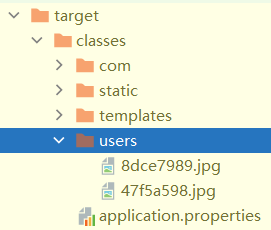

上传成功，接收到的文件会存放在 target/classes/users/ 下

#### OpenCV 环境配置

在官网上下载对应的.exe安装包安装到磁盘

##### 将 opencv jar包安装至 Maven 本地仓库

命令行中输入 Maven 命令：

mvn install:install-file -Dfile=C:/.../opencv/build/java/opencv-440.jar -DgroupId=com.opencv -DartifactId=opencv -Dversion=4.4.0 -Dpackaging=jar

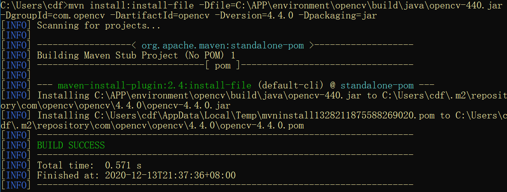

（其实不用）在下一步骤中顺带加入 opencv-440.jar 就好了

##### 导入动态链接库

再将 windows 的动态链接文件 `opencv_java440.dll` 加入到*项目本地库*中：Project Structure -> Project Settings -> Libraries -> New Project Library Java

如果没有这步则需要在 Run Configurations 中配置 VM options: `-Djava.library.path=C:\...\opencv\build\java\x64`

否则会报 `java.lang.UnsatisfiedLinkError: no opencv_java440 in java.library.path`

参考：https://blog.csdn.net/qq_36014509/article/details/105831325

主函数中加入：`System.loadLibrary(Core.NATIVE_LIBRARY_NAME);`

#### 编写图片预览功能

##### controller/UpdateController.java

```java
/**
 * 在request域中放入图片路径列表pathList 用以在客户端预览展示
 * @param model
 */
@GetMapping("/preview")
public String processImgs(HttpSession session, Model model) {
    String id = session.getId();
    ArrayList<String> list = userSessionMap.get(id);
    if (list == null)
        return "preview";

    ArrayList<String> pathList = new ArrayList<>();
    String filePath = "";
    for (String img : list) {
        filePath = "/users/"+img;
        pathList.add(filePath);
    }
    model.addAttribute("pathList", pathList);

    return "preview";
}
```

在客户端发出每个请求时，服务器都会创建一个request对象，并把请求数据封装到request中，然后在调用Servlet.service()方法时传递给service()方法，这说明在service()方法中可以**通过request对象来获取请求数据**。

在请求转发的语境下，`HttpServletRequest` 是一个**域对象**，即一个容器（可以当作Map来存取数据）。

这里的用法相当于原生方法 `request.setAttribute("pathList", pathList);`

##### preview.html

```html
<head>
    <link th:href="@{/webjars/bootstrap/4.5.2/css/bootstrap.min.css}" rel="stylesheet">
    <link th:href="@{/asserts/css/signin.css}" rel="stylesheet">
    <title>PREVIEW</title>
</head>
<body>
<div class="d-flex w-100 h-100 flex-column justify-content-between">
    <div class="d-flex imgs" th:each="path : ${pathList}">
        
    </div>
</div>
</body>
```

解析后如下：

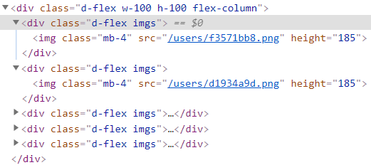

#### 编写选定图片功能

##### 添加选项框和全选按钮

```html
<!-- preview.html -->
<div>
    <div>
        <!-- 全选图片按钮 -->
        <input id="checkAll_btn" type="button" value="全选"/>
        <input id="check_all" type="checkbox" hidden="hidden"/>
        <!-- 确认跳转到处理页面 -->
        <form action="/process" method="get">
            <input type="button" value="确定">
        </form>
    </div>
    <!-- 将request域中的图片路径取出展示 -->
    <div th:each="path : ${pathList}">
        
        <input type='checkbox' class='check_item'/>
    </div>
</div>
```

```javascript
<script th:inline="javascript">
    /* 全选功能 */
    let $checkAll = $("#check_all");
    $("#checkAll_btn").click(function () {
        $checkAll.prop("checked", !$checkAll.prop("checked"))
        // 对于原生 dom，attr 获取自定义的值，prop 获取 dom 原生属性的值
        $(".check_item").prop("checked", $checkAll.prop("checked"));
    });
    // check_item 关联 check_all
    $(document).on("click", ".check_item", function() {
        let flag = $(".check_item:checked").length ==  $(".check_item").length;
        $checkAll.prop("checked", flag);
    });
</script>
```

##### 以表单形式发送请求，转发到待处理页面

```html
<!-- preview.html -->
<div class="d-flex w-100 h-100 flex-column">
    <div class="d-flex mb-4 w-25 align-self-end">
        <!-- 全选图片按钮 -->
        <input id="checkAll_btn" type="button" value="全选"/>
        <input id="check_all" type="checkbox" hidden="hidden"/>
        <!-- 确认跳转到处理页面 -->
        <form id="process_from" action="/process" method="post">
            <input name="imgs" hidden="hidden"/>
            <input name="_method" value="put" hidden="hidden"/>
            <input id="process_btn" type="button" value="确定"/>
        </form>
    </div>
    <!-- 将request域中的图片路径取出展示 -->
    <div class="d-flex mb-4 w-25 justify-content-between align-items-center" th:each="path : ${pathList}">
        <!-- 将路径数据暂存在img标签的data中 -->
        
        <input type='checkbox' class='check_item d-flex'/>
    </div>
</div>
```

下面我们会将所有选中图片的路径放入数组作为**请求参数 (imgs) **放入表单。因为担心在图片较多时， get 请求放不下这里多信息，所以采用 put 方式，**我们用 <input> 标签加入了一个参数 *"_method"="put"* **

```javascript
<script th:inline="javascript">
    <!-- ... -->
    
    /* 确认待处理图片 */
    $("#process_btn").click(function () {

        let imgsList = new Array();
        $.each($(".check_item:checked"), function () {
            let src = $(this).parent("div").find("img:first").data("path");
            imgsList.push(src);
        });

        if ($(".check_item:checked").length < 1) {
            alert("未选择图片！")
            return;
        }
        if (confirm("共处理『"+$(".check_item:checked").length+"』张图片！")) {
            // 发送表单请求 转发待处理页面
            let $processFrom = $('#process_from');
            let $imgs_input = $processFrom.find("input:eq(0)");
            $imgs_input.attr("value", imgsList);
            $processFrom.submit();
        }
    });

</script>
```

**动态的改变 input 标签中 value 值，以变更请求参数**

#### 图片处理工作页面

##### controller/ProcessController.java

接收上一步前端传来的 PUT 请求

```java
@PutMapping("/process")
public String process(@RequestParam("imgs") List<String> imgsList, Model model) {
    ArrayList<String> list = new ArrayList<>();
    String s = "";
    for (String img : imgsList) {
        s = img.split("/")[2];
        list.add(s);
    }
    model.addAttribute("processList", list);

    return "process";
}
```

请求转发到 process.html 时，我们将在 preview.html 选中的图片路径列表储存在 request 域的 processList 中

##### process.html

我们打算把工作页面分为三个区域：左边的*待处理图片区*；中间的*处理效果预览区*；右边的*操作控制区*。

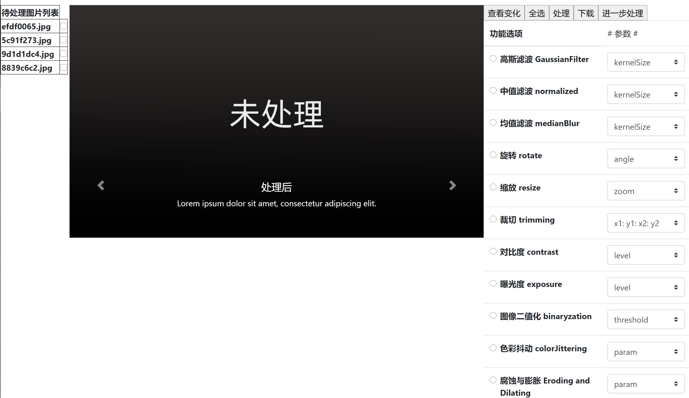

###### 左边的*待处理图片区*

```html
<!-- process.html -->
<div class="d-flex w-100 h-100">    
	<!--  左 图片列表  -->
    <div class="d-flex mb-4 w-10 justify-content-start">
        <table border="1px">
            <tr><th><span>待处理图片列表</span></th></tr>
            <tr th:each="img : ${processList}">
                <th>
                    <span class="imgSpan" th:text="${img}" th:attr="data-imgName=${img}"></span>
                </th>
                <th class="hide">
                    <input type='checkbox' class='check_item'/>
                </th>
            </tr>
        </table>
    </div>
```

取出 request 域中的 processList 陈列，顺带将每一个路径储存在 **属性attr** data-imgName 中

###### 中间的*处理效果预览区*

采用 BootStrap 中的轮播模块，后续会结合 js 将它编成可以动态查看**选定图片的处理前后差异**的展示框

```html
<!--  中 处理预览  -->
<div id="carouselExampleIndicators" class="d-flex mb-4 w-60 carousel slide" data-ride="carousel"
     data-interval="false">
    <ol class="carousel-indicators">
        <li data-target="#carouselExampleIndicators" data-slide-to="0"></li>
        <li data-target="#carouselExampleIndicators" data-slide-to="1" class="active"></li>
    </ol>
    <div class="carousel-inner">
        <div id="origin_item" class="carousel-item">
            
            <div class="carousel-caption d-none d-md-block">
                <h5>处理前</h5>
                <p>Nulla vitae elit libero, a pharetra augue mollis interdum.</p>
            </div>
        </div>
        <div id="disposed_item" class="carousel-item active">
            
            <div class="carousel-caption d-none d-md-block">
                <h5>处理后</h5>
                <p>Lorem ipsum dolor sit amet, consectetur adipiscing elit.</p>
            </div>
        </div>
    </div>
    <a class="carousel-control-prev" href="#carouselExampleIndicators" role="button" data-slide="prev">
        <span class="carousel-control-prev-icon" aria-hidden="true"></span>
        <span class="sr-only">Previous</span>
    </a>
    <a class="carousel-control-next" href="#carouselExampleIndicators" role="button" data-slide="next">
        <span class="carousel-control-next-icon" aria-hidden="true"></span>
        <span class="sr-only">Next</span>
    </a>
</div>
```

###### 右边的*操作控制区*

上部按钮区

```html
<div class="d-flex">
    <!-- 查看前后变化按钮 -->
    <input id="cycle" type="button" value="查看变化"/>
    <!-- 全选图片按钮 -->
    <input id="checkAll_btn" type="button" value="全选"/>
    <input id="check_all" type="checkbox" hidden="hidden"/>
    <!-- 动态处理 -->
    <form id="process_from" action="/process" method="post">
        <input name="imgs" hidden="hidden"/>
        <input id="process_btn" type="button" value="处理"/>
    </form>
    <!-- 打包下载 -->
    <input id="download_btn" type="button" value="下载"/>
    <!-- 跳转到下一个处理页面 -->
    <form id="next_process_from" action="/process" method="post">
        <input name="imgs" hidden="hidden"/>
        <input name="_method" value="put" hidden="hidden"/>
        <input id="next_process_btn" type="button" value="进一步处理"/>
    </form>
</div>
```

下部功能选项区

```html
<div class="d-flex">
    <table class="table table-hover">
        <thead>
            <tr>
                <th scope="col">功能选项</th>
                <td># 参数 #</td>
            </tr>
        </thead>
        <tbody>
            <tr>
                <th scope="row">
                    <div class="form-check">
                        <input class="form-check-input" type="radio" name="method" id="radios1" value="GaussianFilter">
                        <label class="form-check-label" for="radios1">
                            高斯滤波 GaussianFilter
                        </label>
                    </div>
                </th>
                <td>
                    <select class="custom-select" onChange="selectOnChangeFunc(this)" required>
                        <option selected disabled value="">kernelSize</option>
                        <option value="3">3</option>
                        <option value="5">5</option>
                        <option value="7">7</option>
                        <option value="">..自定义..</option>  // 弹出自定义输入框
                    </select>
                    <input type="text" id="GaussianFilter" class="cls_input" value="" hidden="hidden">
                </td>
            </tr>
            <!-- ... -->
```

编辑弹出框 js 逻辑

```javascript
/* 控制下拉列表的自定义操作 */
function selectOnChangeFunc(thisSpan) {
    let idInput = $(thisSpan).parents("td").find("input:first")[0];
    let idSelect = thisSpan;
    idInput.value = idSelect.options[idSelect.selectedIndex].value;
    if (idSelect.selectedIndex != idSelect.childElementCount-1)
        idInput.setAttribute("hidden", "hidden");
    else if (idInput.hasAttribute("hidden"))
        idInput.removeAttribute("hidden");
}
```

**点击处理按钮 向后端发送处理图片请求**

```javascript
/* 处理图片 */
$("#process_btn").click(function () {

    let imgsList = [];
    $.each($(".imgSpan"), function () {
        let src = $(this).attr("data-imgName");  // 不知道为什么 .data("imgName") 取不了
        // 这里需要加判断 从/users还是/out中取
        imgsList.push("/users/"+src);
    });

    if ($(".check_item").length < 1) {
        alert("未选择图片！");
        return;
    }
    if (confirm("共处理『"+$(".check_item").length+"』张图片！")) {
        // 选中的处理方法名
        let method_checked = $(".form-check-input[name='method']:checked").val();
        // 发送Ajax异步请求 处理图片
        $.ajax({
            type: 'post',
            url: "/process",
            data: {
                "imgs" : imgsList,  // 要求该文件名带路径前缀
                "method" : method_checked,
                "param" : $("#"+method_checked).val()  // 不用额外选择属性或类型
            },
            traditional:true,
            success: function (res) {
                alert(res);
            },
            error: function (e) {
            }
        })
    }
});
```

#### 图片处理后台逻辑

*ProcessController.java*

```java
/**
 * 在图片处理工作界面选定图片后点击“处理”按钮执行
 * 前端 Ajax 请求
 * @param imgsList 文件名列表，需要带上路径前缀
 */
@PostMapping("/process")
@ResponseBody
public String process(@RequestParam("imgs") List<String> imgsList,
                      @RequestParam("method") String method,
                      @RequestParam("param") Double param) {

    if (imgsList == null)
        return "未有照片选中";
    if (method == null || param == null)
        return "处理参数错误";

    List<String> collect = imgsList.parallelStream().map(x -> {
        return processService.process(x, method, param);
    }).collect(Collectors.toList());

    return "处理成功";
}
```

利用 **parallelStream 并行流**，并行地处理每一张图片提高系统效率

*ProcessService.java*

```java
public String process(String img, String method, double param) {
        try {

            String classPath = ResourceUtils.getURL("classpath:").getPath();
            // 创建输出文件夹
            String outFilePath = classPath + "static/out/";
            File fp = new File(outFilePath);
            if (!fp.exists())
                fp.mkdir();

            /* 利用反射按函数名调用方法 */
            long l = System.currentTimeMillis();
            Method mtd = OpencvProcess.class.getMethod(method, String.class, double.class);
            mtd.invoke(null, img, param);
            long processTime = System.currentTimeMillis() - l;
            LOGGER.info("处理完成 " + method + " : " + processTime);

        } catch (Exception e) {
            LOGGER.error(e.getMessage(), e);
        }
        return "/out/"+img.split("/")[2];
    }
```

*OpencvProcess.java*

```java
public class OpencvProcess {

    public OpencvProcess() {}

    private static final Logger LOGGER = LoggerFactory.getLogger(UploadController.class);

    private static String classPath;

    static { try {
        classPath = ResourceUtils.getURL("classpath:").getPath().substring(1);
    } catch (FileNotFoundException e) { e.printStackTrace(); } }

    /**
     * 归一化块滤波器 (normalized box filter)
     */
    public static void normalizedBoxFilter(String img, double kernelSize) {
        try {
            String filePath = classPath.concat("static").concat(img);
            String outputPath = classPath.concat("static/out/");
            Mat src = Imgcodecs.imread(filePath, Imgcodecs.IMREAD_COLOR);
            if( src.empty() )
                LOGGER.warn("Error opening image");
            
            Mat dst = src.clone();
            Size ksize = new Size(kernelSize, kernelSize);
            // 归一化块滤波
            Imgproc.blur(src, dst, ksize, new Point(-1, -1));  // borderType ignore
            Imgcodecs.imwrite( outputPath.concat(img.split("/")[2]), dst );
        } catch (Exception e) {
            LOGGER.error(e.getMessage(), e);
        }
    }
    /* ... */
```

这里有一个坑是 `ResourceUtils.getURL("classpath:")` 获取的路径第一个字符是 “/” ，系统会识别不了，需要截断。

测试一下，功能正常！

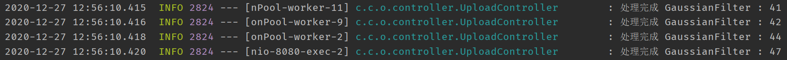

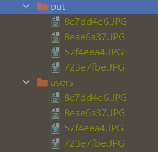

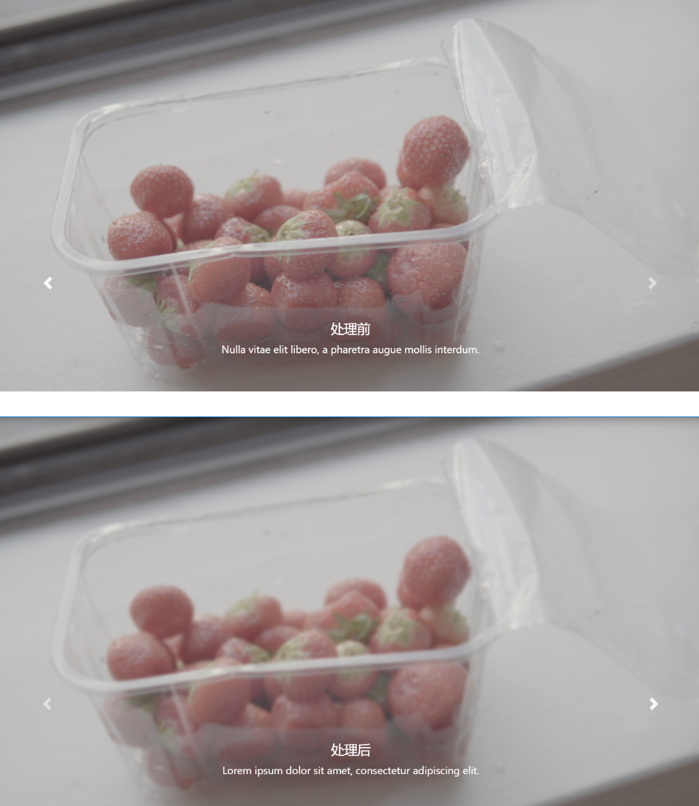


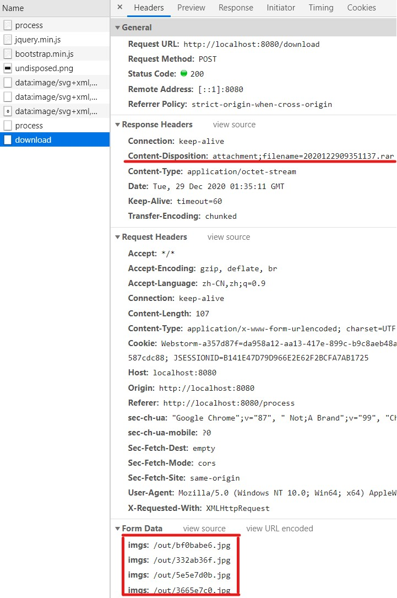

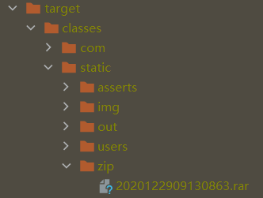

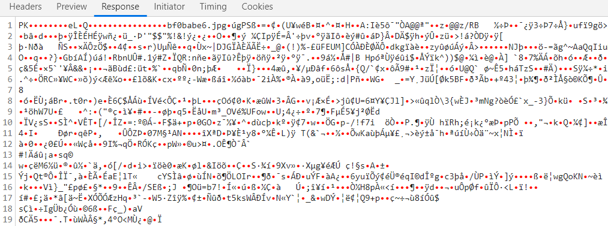

<!-- https://mvnrepository.com/artifact/org.apache.ant/ant -->
<dependency>
    <groupId>org.apache.ant</groupId>
    <artifactId>ant</artifactId>
    <version>1.10.8</version>
</dependency>